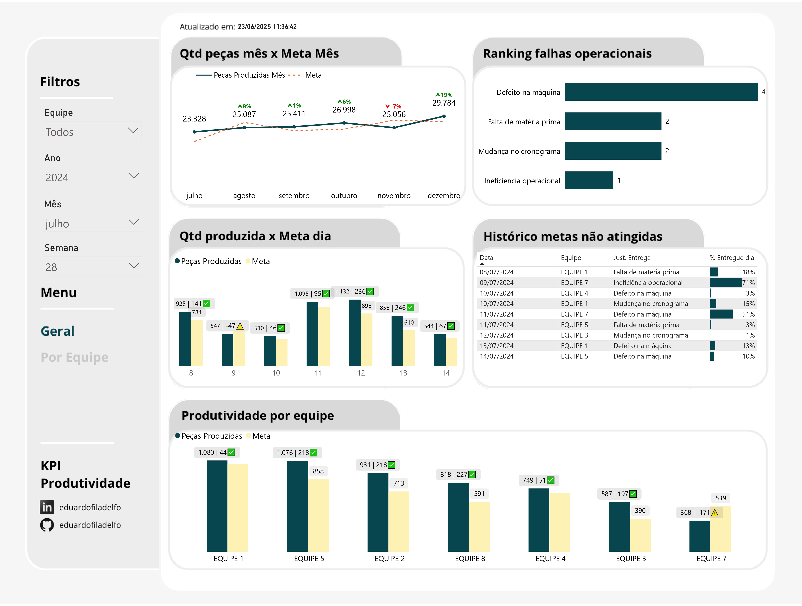
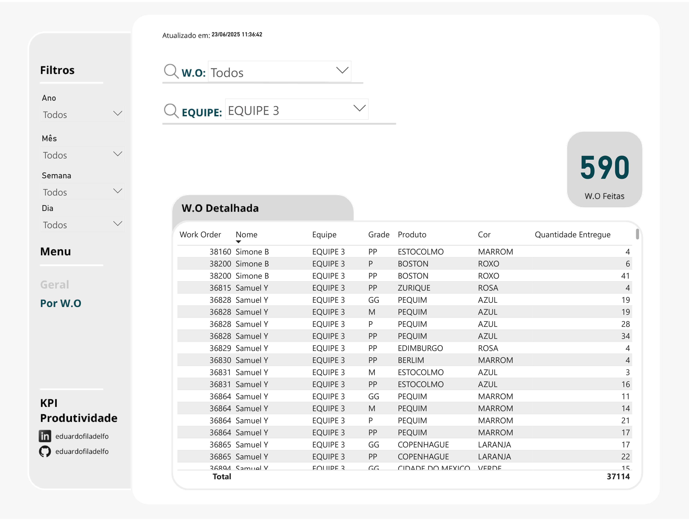
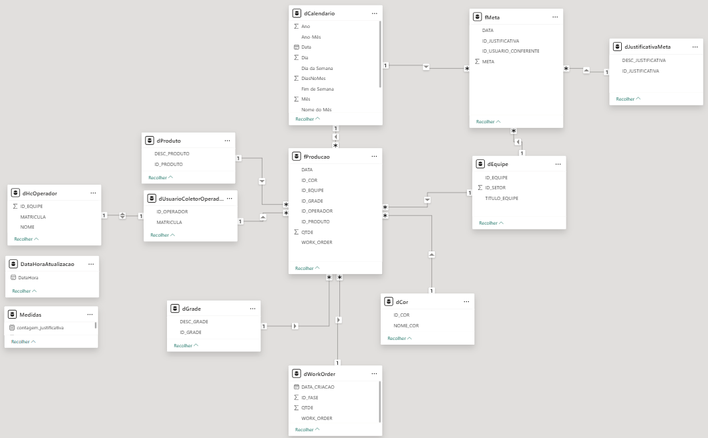

# Dashboard-Insights-de-Produtividade-Na-Confeccao-de-Camisetas-no-Power-BI

 ### 🌍 Overview do Projeto

Este KPI foi criado com o intuito de promover insights sobre a produtividade geral e por equipes de uma fábrica que produz camisetas entre julho de 2024 até junho de 2025. A análise abrange múltiplos aspectos sobre a produtividade, incluindo:

- O comparativo entre a produtividade ao longo do ano versus a meta estabelecida  do período citado acima;

- Ranqueamento dos motivos pelos quais as metas não foram atingidas;

- Histórico diário detalhado das metas que não foram antingidas por equipe e justificativa;

- Detalhamento das peças produzidas por equipe ao longo do período por Work Orders.

  

### ✅ Perguntas de Negócio

O intuito desse relatório é responder às seguintes perguntas de negócio:

1. É possível visualizarmos a quantidade de peças que foram produzidas de peças mensalmente ao longo do ano e a meta que foi estabelecida? 

2. É possível visualizarmos também a variação percentual da produtividade em relação ao mês anterior? 

2. Quais são as falhas operacionais? Quais os problemas mais recorrentes?

3. Qual a produtividade diária das equipes em relação à meta? É possível visualizarmos também a diferença entre saldo programado e o realizado?

4. Quais foram as metas que não foram atingidas e qual a justificativa?

5. Qual a produtividade total por cada equipe? É possível visualizarmos também a diferença entre saldo programado e o realizado?

6. É possível visualizarmos As Work Orders de forma detalhada de todo o período?

### 🗂️ Dataset

O conjunto de dados nesse dataset tem autoria própria e está disponível para download em...

### 🛠️ Ferramentas: 

Power BI:  Importação dos arquivos em CSV e visualização dos dashboards.
Canva: Criação do design visual do indicador, permitindo uma apresentação mais clara dos insights obtidos na análise.

### 📝 Dados Utilizados
Para a anáise, foram utilizadas as seguintes tabelas: 

- fProducao: Registro histórico das peças que foram produzidas pelas equipes;
- fMeta: Metas estabelecidas para as equipes por meta diária;
- dEquipe: Tabela dimensão com as equipes que produzem as peças;
- dJustificativaMeta: Tabela dimensão com as justificativas de forma detalhada quando as metas não são atingidas; 
- dCalendario: Tabela dimensão com as datas do período;
- dWorkOrder: Tabela dimensão das Work Orders, suas fases (fase de confecção) e a quantidade de peças que serão produzidas;
- dCor: Tabela dimensão contendo as cores das camisetas; 
- dGrade: Tabela dimensão contendo os tamanhos das peças;
- dEquipe: Tabela dimensão com as equipes que realizam o processo de confecção;
- dProduto: Tabela dimensão com o nome dos produtos que são confeccionados; 
- dHcOperador: Tabela dimensão da relação de nome, matrícula e qual equipe o funcionário pertence;
- dUsuarioColetorOperador: Tabela dimensão com o id utilizado pelo operador ao acessar o coletor e sua matrícula.

### ⚙️ Estrutura do dashboard

#### Página Geral

O relatório mostra de forma detalhada as quantidades de peças produzidas com base nas metas estabelecidas diária, semanal e mensalmente, além de exibir o ranking de falhas operacionais e o histórico de das metas que não foram atingidas, sendo eles: 

- Qtd peças mês x Meta Mês: Relação Quantidade de peças produzidas por mês versus meta estabelecida. É possível visualizar também o comparativo de peças produzidas MoM (month over month)

- Ranking de falhas operacionais: Gráfico ranqueado das falhas operacionais do período, com visualização do anual, mensal e semanal. Podendo também a filtragem por equipe.
 
- Qtd produzida x Meta Dia: Histórico da produtividade diária versus meta estabelecida com a visualização do saldo de pegas entregues em relação a meta, podendo ser positivo ou negativo. Podendo também a filtragem por equipe. 

- Histórico de Metas não Atingidas: Tabela com a relação de metas não atingidas por data, equipe, Justificativa da falha operacional e a porcentagem entregue no dia. 

- Produtividade por Equipe: Produtividade semanal da equipe, com a visualização do saldo de pegas entregues em relação a meta, podendo ser positivo ou negativo.

  

  
  
  

#### Página Por W.O

O relatório mostra de forma detalhada a produtividade da equipe dada sua Work Order, com a filtragem anual, mensal, semanal e diária. Também é possível a filtragem por equipe, sendo:

-	Work Order: Número da Work Order;
-	Nome: Nome do operador responsável pela confecção;
-	Equipe: Nome da Equipe que o operador pertence;
-	Grade: Tamanho da peça confeccionada;
-	Produto: Nome do produto confeccionado;
-	Cor: Cor do produto confeccionado;
-	Quantidade peças: Quantidade de peças entregues.

    

  
  
  

### 🕸️ Diagrama ER

ㅤ
    

  
  
  

### 🎯 Tratamento dos dados 
O tratamento dos dados foi realizado via Excel na extração dos dados, algumas linhas da coluna "QTDE" na tabela fProducao continham valores nulos, logo, foram removidas.

